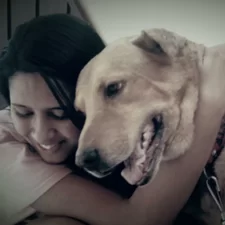

<header class="row gx-5 align-items-center justify-content-center">
    

        <h1 class="display-3 fw-bolder text-white mb-4 animate__animated animate__fadeIn">
            Educação e tecnologia para todas as pessoas
        </h1>
        <blockquote class="blockquote text-white-50 animate__animated animate__fadeIn">
            
"Para as pessoas sem deficiência, a tecnologia torna as coisas mais fáceis. Para as pessoas com deficiência, a tecnologia torna as coisas possíveis"

            <footer class="blockquote-footer text-white-50">Mary Pat Rabanaugh</footer>
        </blockquote>
    

</header>

<section class="video-section my-5" aria-labelledby="video-presentation">
    <h2 id="video-presentation" class="visually-hidden">Vídeo de apresentação do projeto</h2>
    

        

            

                

                    <iframe
                        id="panda-7c9d8bd5-13eb-4732-b47d-6886351f4593"
                        src="https://player-vz-480faebf-94f.tv.pandavideo.com.br/embed/?v=7c9d8bd5-13eb-4732-b47d-6886351f4593"
                        style="border:none;position:absolute;top:0;left:0;"
                        allow="accelerometer;gyroscope;autoplay;encrypted-media;picture-in-picture"
                        allowfullscreen="true"
                        width="100%"
                        height="100%"
                        loading="lazy"
                        title="Vídeo de apresentação do PcD na Escola">
                    </iframe>
                

            

        

    

</section>

<section class="target-audiences py-5" aria-labelledby="publicos-titulo">
    

        <h2 id="publicos-titulo" class="text-center fw-bolder text-white mb-5 animate__animated animate__fadeIn">
            Públicos Prioritários
        </h2>
        
        

            

                <article class="card h-100 bg-dark border-0 shadow-sm">
                    

                        location_on
                        <h3 class="h5 text-white">Nordeste</h3>
                        
Há mais pessoas com deficiência fora da escola do que a média nacional.

                    
  
                </article>
            

            

                <article class="card h-100 bg-dark border-0 shadow-sm">
                    

                        location_city
                        <h3 class="h5 text-white">Interior</h3>
                        
É difícil acessar informações especializadas porque fica longe dos grandes centros.

                    

                </article>
            

            

                <article class="card h-100 bg-dark border-0 shadow-sm">
                    

                        diversity_1
                        <h3 class="h5 text-white">Comunidade</h3>
                        
O capacitismo acontece em todos os lugares e combater isso precisa de ações conjuntas.

                    

                </article>
            

            

                <article class="card h-100 bg-dark border-0 shadow-sm">
                    

                        school
                        <h3 class="h5 text-white">Escolas</h3>
                        
Para colaborar com a comunidade escolar, docentes, estudantes e familiares.

                    

                </article>
            

        

    

</section>

<section class="mission-vision py-5">
    

        

            

                <figure>
                    
                </figure>
            

            

                <article>
                    <h2 class="fw-bolder text-white mb-4">Visão</h2>
                    

                        Queremos ser um lugar excelente para compartilhar conteúdo sobre educação, tecnologia e
                        acessibilidade, ajudando na formação crítica e histórica de pessoas com deficiência.
                    

                </article>
            

        

        

            

                <figure>
                    
                </figure>
            

            

                <article>
                    <h2 class="fw-bolder text-white mb-4">Missão</h2>
                    

                        Queremos facilitar o acesso ao conhecimento, independentemente das necessidades educacionais
                        de quem deseja aprender. Também buscamos colaborar com o diálogo social sobre os direitos
                        das pessoas com deficiência, considerando a diversidade e baseando-nos em princípios legais,
                        científicos e laicos.
                    

                </article>
            

        

    

</section>

<section class="testimonial py-5" aria-label="Depoimento">
    

        

            

                <figure class="mb-4">
                    
                </figure>
                <blockquote class="blockquote">
                    

                        "Criei o site para outras pessoas com deficiência saberem que elas não estão sozinhas e
                        que a educação e a tecnologia podem ser acessíveis sim."
                    

                    <footer class="blockquote-footer text-white">
                        <cite>Louise Suelen</cite>
                    </footer>
                </blockquote>
            

            

                

                    <iframe
                        id="panda-25f13c60-bac7-45a9-be54-d519419335b7"
                        src="https://player-vz-480faebf-94f.tv.pandavideo.com.br/embed/?v=25f13c60-bac7-45a9-be54-d519419335b7&iosFakeFullscreen=true"
                        style="border:none;position:absolute;top:0;left:0;"
                        allow="accelerometer;gyroscope;autoplay;encrypted-media;picture-in-picture"
                        allowfullscreen=true 
                        width="100%" 
                        height="100%" 
                        fetchpriority="high">
                    </iframe>
                    
                

            

        

    

</section>

<section class="principles py-5" aria-labelledby="principios-titulo">
    

        <h2 id="principios-titulo" class="text-center fw-bolder text-white mb-5">Princípios</h2>
        
        

            

                <article class="text-center">
                    diversity_4
                    <h3 class="fw-bold text-white my-3">Humanidade</h3>
                    

                        A naturalização da pessoa com deficiência enquanto ser humano, afastando-se por
                        completo do padrão que tende a extremos de inferioridade e superação.
                    

                </article>
            

            

                <article class="text-center">
                    diversity_2
                    <h3 class="fw-bold text-white my-3">Respeito</h3>
                    

                        O respeito absoluto e incondicional a laicidade e aos valores políticos, jurídicos e
                        sociais do Estado Democrático de Direito na abordagem sobre a deficiência.
                    

                </article>
            

            

                <article class="text-center">
                    swords
                    <h3 class="fw-bold text-white my-3">Combate</h3>
                    

                        O combate ao preconceito inclusive entre as diferentes comunidades de pessoas com
                        deficiência e a equivocada hierarquização de deficiências.
                    

                </article>
            

        

    

</section>
